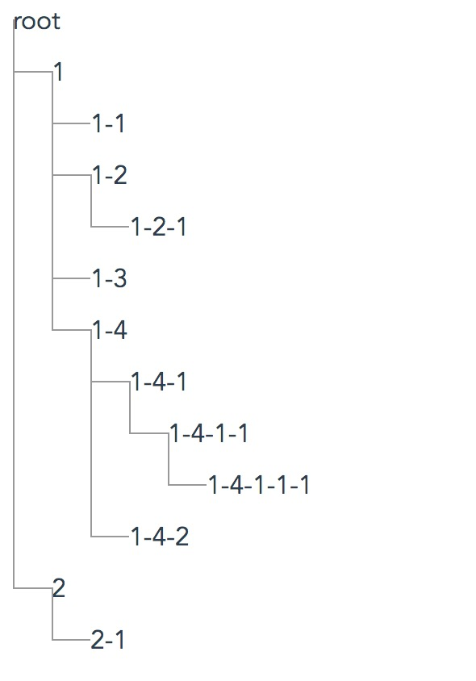
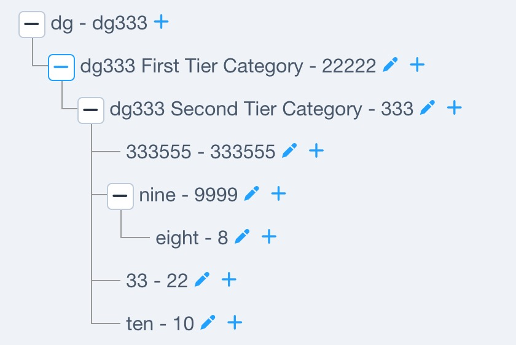

# vue-sortable-tree
[](https://www.npmjs.com/package/vue-sortable-tree)

[Demo Link](http://examples.itrydo.com/vue-sortable-tree/index.html)

[Demo Link Source Code](https://github.com/wuyuedefeng/vue-sortable-tree/blob/master/example/src/components/Hello.vue)

 **QQ交流群:** 424580388

## Install
vue version < 2.5
```
$ npm install vue-sortable-tree@1.1.0 --save [must < 1.2.0]
```
vue version >= 2.5
```
$ npm install vue-sortable-tree --save
```

### Global register
```javascript
import SortableTree from 'vue-sortable-tree'
Vue.component(SortableTree.name, SortableTree)
```

### Partial register
```javascript
import SortableTree from 'vue-sortable-tree'

// then in component
components: {
  [SortableTree.name]: SortableTree
}
```
## Usage
```vue
<template>
  <sortable-tree :data="treeData">
    <template slot-scope="{item}">
      <span>{{item.name}}</span>
    </template>
  </sortable-tree>
</template>
```

### Params
```vue
<sortable-tree :data="treeData" attr="name" childrenAttr="children" mixinParentKey="$parent" @changePosition="changePosition">
  <template slot-scope="{item}">
    <span>{{item.name}}</span>
  </template>
</sortable-tree>
```

Property | Type | Default | Description
-------- | ---- | ------- | -----------
`data` | `Object` | - | Tree data source.
`attr` | `String` | `'name'` | A name of property in data source that will be display.
`childrenAttr` | `String` | `children` | A name of property in data source that contain children node.
`mixinParentKey` | `String` | `''` | A name of property that contain parent data.
`closeStateKey` | `String` | `''` | A name of property to determine the open/close state.
`draggable` | `Boolean` | `true` | Enable dragging the tree node.

Event | Parameter | Description
----- | --------- | -----------
`changePosition` | `{beforeParent, data, afterParent}` | Trigger when node position has been changed.


### 依赖 sass[scss] support
if your project can't support scss  please add below dependence

```
npm install node-sass --save-dev
npm install sass-loader --save-dev
```

## Project demo image


You can design your style easily with custom template.

**eg:**


